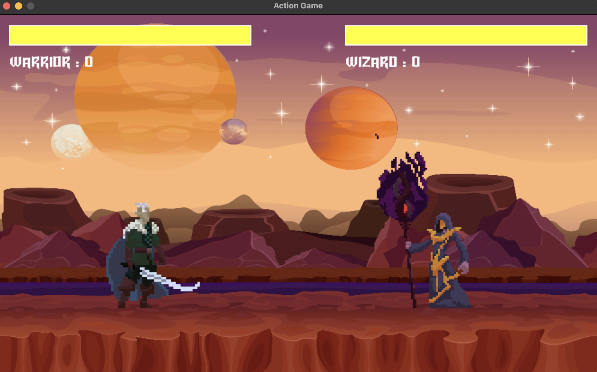

# A 2D Fighting Game



Welcome to the Action-Game repository, a 2D fighting game built using Python and Pygame. This project is a fun venture into game development, heavily inspired by Coding with Russ, whose tutorials provided essential guidance.

## Getting Started

To try out the Action Game, follow these steps:

### Step 1: Download the Game

Download the game files by clicking the "Code" button above and selecting "Download ZIP". This will download a folder containing all the necessary files.

### Step 2: Install Pygame

Ensure you have Pygame installed. Open your command prompt or terminal and run:

```bash
pip install pygame
```
This command will install the Pygame library.

### Step 3: Check File Paths

Make sure the file paths in the game code match the locations where you've stored the files on your system. Adjust the paths if needed.

### Step 4: Run the Game
Navigate to the directory containing the game's files in your command prompt or terminal. Run the game with:

```bash
python main.py
```
Ensure you're in the directory where main.py is located before running this command.

### Step 5: Enjoy
Play the game and have fun!!

# Game Development Journey
## Acknowledgment
This project draws inspiration from the tutorials by Coding with Russ. His detailed explanations and coding examples were instrumental in developing this game.

## Project Overview
This Game is a 2D fighting game designed and developed in Python using the Pygame library. The game features dynamic combat scenes, health management, and various animations representing different states of the fighters.

## Project Setup and Initialization
The project begins with setting up the Pygame environment, which involves initializing necessary modules to ensure smooth functionality. This setup includes configuring the game window, specifying its dimensions, and setting a title for a professional look.

## Design of Game Components
The game employs a modular design for characters, with each fighter encapsulated within a Fighter class. This class manages all attributes and behaviors related to the character, such as health, position, and movement.

## Health Bar System
Each fighter has a health bar that decreases with each hit, adding a strategic element to the game. The health system updates in real-time to reflect the consequences of combat actions.

## Game Dynamics and Interaction
The game's interactivity is managed through an event-handling system that listens for user inputs and responds to trigger character movements or actions. Game state management involves checking conditions, such as whether a fighter's health has reached zero, triggering appropriate animations and potentially ending the game round.

## Animations and Character Interaction
Characters have multiple animations representing different states, such as idle, jumping, attacking, being hit, and dying. These animations transition smoothly based on user input and game conditions, enhancing the visual experience.

## Graphical and Audio Enhancements
### Visual Elements
A detailed background image sets the theme and mood of the combat arena. Visual elements like health bars and score counters are integrated to provide important game information.

### Audio Integration
Background music and sound effects for different actions are added to enhance the gaming experience, providing feedback on player actions and in-game events.

## Challenges and Solutions
During development, various challenges were encountered, particularly with performance optimization and debugging. Solutions included refining collision detection algorithms and optimizing image rendering processes to ensure smooth gameplay on lower-spec devices.

## Conclusion
This project has been a fantastic journey into game development, highlighting the importance of technical skills, creative design, and user feedback. Thank you for exploring the Brawler Game repository. Feel free to try out the game, explore the code.
